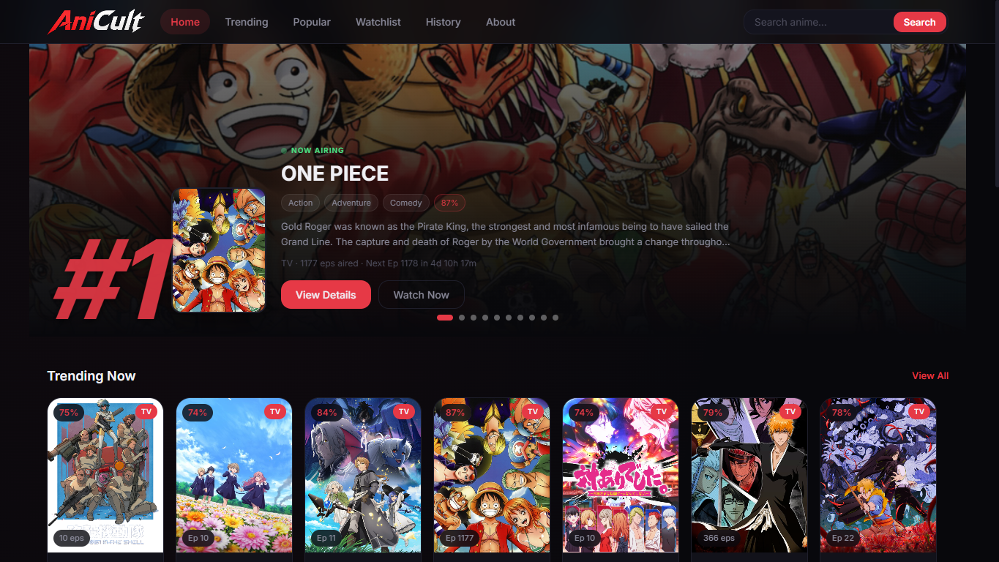

<h1 align="center">AniCult</h1>

<p align="center">
  A clean anime streaming experience — browse via AniList, watch via direct embed players.
</p>

<p align="center">
  <a href="https://anicult.vercel.app/"></a>
  <a href="https://github.com/aluukill/AniCult"></a>
</p>

<p align="center">
  
</p>

---

## About

AniCult is a fully client-side single-page application. No server, no build step, no runtime dependencies. Open `index.html` and it works.

- **Anime browsing** uses the AniList GraphQL API (CORS-enabled)
- **Video playback** uses Megavid embed player (AniList ID based, no scraping)

## Features

- **Anime Discovery** — Hero slideshow of top airing anime, plus trending, popular, and recently updated rows from AniList
- **Search & Filters** — Full-text search with 6 sort options (relevance, trending, popularity, score, newest, recently updated) and format filters (TV, Movie, OVA, ONA, Special)
- **Anime Details** — Synopsis, genres, stats, episode grid with air dates, related anime
- **Embed Streaming** — Instant playback via the Megavid embed API with sub/dub toggle, auto-next on episode completion, and error handling with retry
- **Multiple Sources** — Switch between the Megavid catalog and the AniWave backend at any time; if one fails, playback silently falls back to the other
- **Dub Detection** — Per-episode, per-source probing so dubbed versions show up whenever they actually exist (no more sub-only locks)
- **Smart Playback** — Skip Intro / Skip Outro buttons, resume prompt from your last position, and remembered preferences (audio, source, speed, quality, toggles)
- **Continue Watching** — Smart CTA that only suggests aired episodes, with rewatch fallback when you're caught up
- **Watchlist & History** — LocalStorage persistence with episode progress tracking
- **Responsive UI** — Dark glassmorphism theme, hamburger nav, mobile-optimized hero and player

## Live Demo

**[anicult.vercel.app](https://anicult.vercel.app/)** — hosted on Vercel, no install required.

## Getting Started

```
open index.html
```

Or deploy your own: fork the repo and connect to Vercel — zero config.

## Files

| File          | What it does                                                   |
| ------------- | -------------------------------------------------------------- |
| `index.html`  | Nav, search bar, main container, SEO meta tags                 |
| `styles.css`  | All styles — dark theme, responsive, components                |
| `app.js`      | SPA router, AniList API, embed player, rendering, localStorage |
| `favicon.svg` | SVG favicon                                                    |
| `vercel.json` | Vercel deployment config                                       |
| `robots.txt`  | Crawler instructions for search engines                        |
| `sitemap.xml` | XML sitemap for SEO                                            |

## How It Works

1. Browse anime on the home page (hero slideshow, trending, popular, recent)
2. Click into a detail page — pick the next aired episode from the grid
3. Megavid embed loads instantly using the AniList ID (MAL ID fallback for older titles)
4. Video plays in an iframe with sub/dub toggle and auto-advances to the next episode when finished
5. History, progress, and watchlist save to localStorage

## License

[MIT](LICENSE)
